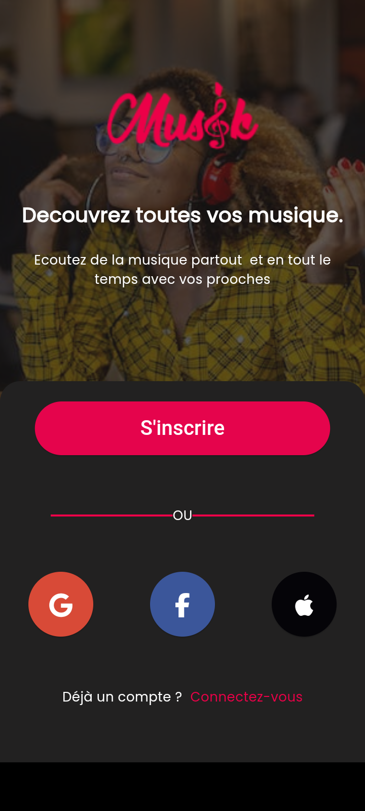
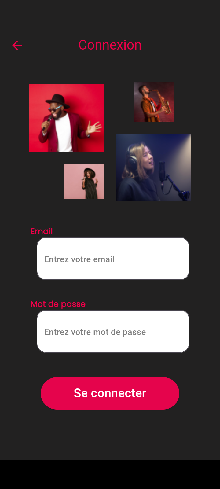
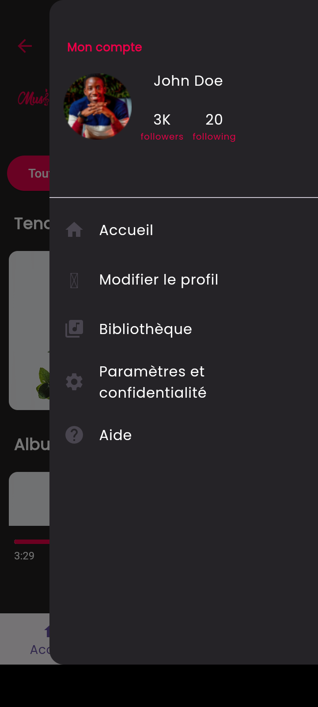

  

# Musik - Application Mobile Flutter de lecture de musique en streaming

  

## Membres du Projet et Taux de Participation

[CONTRIBUTING.md](CONTRIBUTING.md)

## Acknowledgments

- [Cahier des charges](Cahier-de-charge-Developpement-dune-application-de-streaming-de-musique-en-ligne-avec-Flutter.pptx)
- [Marquette](https://www.figma.com/file/yU4f5wiiEmJoJp6bn8D1Oj/Streamusik?type=design&node-id=0-1&mode=design&t=5ffuQDmWEz8KUpFt-0)
- [Backend API documentation](https://documenter.getpostman.com/view/15632620/UVeAuowo#a8e566a3-ba1c-461d-80e9-59401c747e1f)
- [Documentation de l'Application](musik-documentation.txt)

## GUIDE D'UTILISATION DE L'APPLICATION MUSIK

Avant toute chose rassurez vous d'avir un e bonne connection à Internet

### OUVERTURE DE L'APPLICATION

Ouvrez l'application.
L'icône de l'application apparaît.
Cliquez sur l'icône, elle vous dirigera vers la page d'inscription.

#### INSCRIPTION/CONNEXION

  

Appuyez sur le bouton "S'inscrire" qui vous dirigera vers la page d'inscription. Remplissez vos informations (NB : votre mot de passe doit comporter au moins 8 caractères avec des minuscules, des majuscules, des chiffres et le caractère "@")

  

  

Si vous avez déjà un compte, vous verrez un lien "Connectez-vous" en bas de la première page, vous permettant de vous connecter en saisissant vos identifiants.
Si vous avez déjà un compte, vous serez directement redirigé vers la page d'accueil.
Après l'inscription, choisissez vos préférences en matière de catégorie de musique et d'artistes pour recevoir des recommandations musicales adaptées à vos goûts.

#### DESCRIPTION DE LA PAGE D'ACCUEIL

  

Sur la page d'accueil, découvrez les tendances, des playlists, et des artistes recommandés.
En haut de la page, retrouvez le profil à droite et l'icône de l'application à gauche.
En bas, la barre de navigation facilite l'accès aux différentes sections.

#### DESCRIPTION DE LA PAGE DE RECHERCHE

Utilisez la barre de recherche en haut pour trouver des chansons, des albums, des artistes et des playlists.
Les résultats s'affichent de manière organisée, facilitant le choix de ce que vous souhaitez écouter.

#### FONCTIONNEMENT DU MENU PROFIL

  

En cliquant sur l'icône de profil, accédez au menu du profil.
Informations du Profil :

Affichez votre nom d'utilisateur, votre image de profil, et d'autres détails.
Options du Profil :

Modifiez votre profil en mettant à jour votre photo, votre nom d'utilisateur
La bibliothèque regroupe vos sauvegardes,likes et playlists.Elle est aussi accessible par la barre de navigation en bas
Le centre d'aide propose des solutions aux problèmes courants.
Quitter le Profil :

Pour quitter le profil, appuyez à nouveau sur l'icône de profil.

#### NAVIGATION DANS L'APPLICATION

En bas, la barre de navigation permet d'accéder aux sections comme l'accueil, la recherche,la bibliothèque.
Explorez ces sections pour découvrir de nouvelles musiques rechercher et réecouter vos musiques préférées

#### JOUER DE LA MUSIQUE

Dans l'accueil appuyer l'une des tendences ou une playlist et laisser vous emporter par la musique selectionné.

## License

This project is licensed under the [MIT License](LICENSE).

